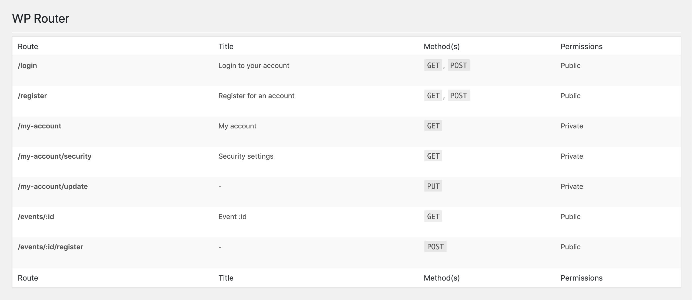

# URL router for WordPress

Easily create custom WordPress routes with this plugin and helper functions.

Comes with an easy to use API and basic admin interface.

> **Attention**
> Still a work in progress, and not tested with [networks/multisites]([https://wordpress.org/support/article/create-a-network/](https://wordpress.org/support/article/create-a-network/))



## Requirements

**PHP** Version 7.2+
**WordPress** Version 5.2+

## Installation

Download and install like a standard WordPress plugin.

You can download the zip file here: [https://github.com/thelevicole/wp-router/archive/master.zip](https://github.com/thelevicole/wp-router/archive/master.zip)

## Registering a route

Once the plugin has been installed and activated it's easy to start registering routes with the helper functions. *A full list of functions is available below.*

**Example 1** - Login page

To create the route, simply use `wp_router_get()` in your functions.php file along with the appropriate parameters.

```php
wp_router_get( '/login', function( $router ) {
	// Stop user from accessing if already logged in
	if ( is_user_logged_in() ) {
		wp_redirect( home_url() );
		exit;
	}

	// Load form template
	get_template_part( 'forms/login' );
}, [ 'title' => 'Login' ] );
```

**Example 2** - Post request

We can create a `POST` request only route in a similar way to example 1 but instead using `wp_router_post()`.

```php
$route_capabilities = [
	'private' => true,
	'capability' => 'subscriber'
];

function profile_save() {
	$user_id = get_current_user_id();
	$name = sanitize_text_field( $_POST[ 'name' ] );
	$email = is_email( $_POST[ 'email' ] );
	wp_update_user( [
		'ID' => get_current_user_id(),
		'display_name' => $name,
		'user_email' => $email
	] );
	wp_reditect( home_url( '/profile/success' ) );
	exit;
}

wp_router_post( '/profile/save', 'profile_save', $route_capabilities );
```

**Example 3** - URL Parameters

Sometimes you will need to capture segments of the URI within your route. For example, you may need to capture a user's ID from the URL.  We can do this with the `:` operator.

```php
class CustomUser {
	function __construct() {
		wp_router_get( '/user/:id', [ $this, 'handle' ] );
	}

	public function handle( $params ) {
		$id = $params[ 'id' ];
		return 'User ' . $id;
	}
}

new CustomUser;
```

## All Functions

### wp_router_register()

`wp_router_register( string|array $method, string $route, callable $callback, array $options  )`

#### Description

Register a route with a specific request method.

#### Parameters

`$method`

*(string|array) (Required) The type of method to for the route to match. Accepts an array or string of the following methods... GET, POST, HEAD, PUT, DELETE, ANY.*

`$route`

*(string) (Required) The url route to match. This can include catchable parameters by using the `:` operator.*

*For example `/locations/:country/:city` and `/:author/books`*

`$callback`

*(callable) (Required) The name of the function you wish to be called when the route is matched.*

`$options`

*(array) (Optional) Additional parameters to passed to the route object.*

#### Usage

```php
wp_router_register( 'POST', '/profile', function( $params ) {
	// Do something with $_POST data
} );

...

wp_router_register( 'GET', '/movies/:year', function( $params ) {
	get_template_part( 'movies', $params[ 'year' ] );
} );
```

#### Aliases

| Alias | Params | Same as |
|--|--|--|
| `wp_router_get()` | $route, $callback, $options | `wp_router_register( 'GET', ... )` |
| `wp_router_post()` | $route, $callback, $options | `wp_router_register( 'POST', ... )` |
| `wp_router_head()` | $route, $callback, $options | `wp_router_register( 'HEAD', ... )` |
| `wp_router_put()` | $route, $callback, $options | `wp_router_register( 'PUT', ... )` |
| `wp_router_delete()` | $route, $callback, $options | `wp_router_register( 'DELETE', ... )` |

### wp_router_params()

`wp_router_params()`

#### Description

Get an array of route parameters if any.

#### Usage

```php
wp_router_get( '/path/:param1/:param2/:third', function() {
	$params = wp_router_params();
	echo $params[ 'param1' ];
	echo $params[ 'param2' ];
	echo $params[ 'third' ];
} );
```

### wp_router_param()

`wp_router_params( string $param, mixed $fallback = false )`

#### Description

Return a single value of a route parameter.

#### Parameters

`$param`

*(string) (Required) Name of the parameter you want returned.*

`$fallback`

*(mixed) (Optional) The fallback value if a parameter is empty.*

*For example `/locations/:country/:city` and `/:author/books`*

#### Usage

```php
wp_router_get( '/path/:param1/:param2/:third', function() {
	echo wp_router_param( 'param1' );
	echo wp_router_param( 'param2' );
	echo wp_router_param( 'third' );
} );
```

## Route options and permissions

There are additional options that can be passed in the `$options` parameter.

| Option | Description | Default |
|--|--|--|
| `title` | *(string) Add a title to the page, accessible via the WordPress functions `get_title()` and `the_title()`.* | `null` |
| `body_class` | *(string) Add custom classes to the body for the specific route.* | `null` |
| `robots` | *(bool) Add nofollow and noindex to the request page header.* | `false` |
| `private` | *(bool) Use this option to expose the route to authenticated users only.* | `false` |
| `capabilities` | *(string) Used in conjunction with `private` option. Only allow specific roles or capabilities to access the route.* | `'manage_options'` |

### Usage

```php
wp_router_get( '/profile', function() { ... }, [
	'title' => 'My Profile',
	'body_class' => 'user-page user-page-profile',
	'robots' => true, // Stop bots
	'private' => true, // Only authed users
	'capabilities' => 'subscriber' // Subscribers only
] );
```
